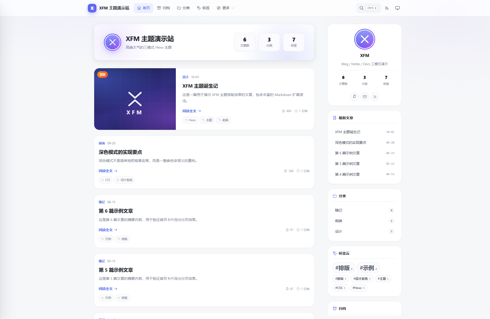
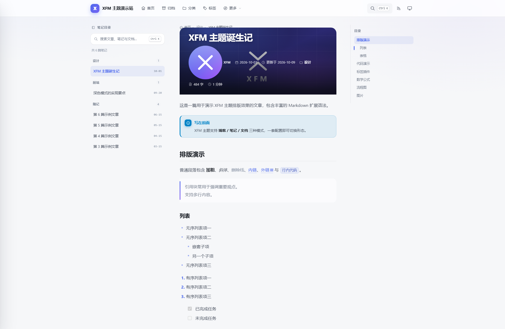
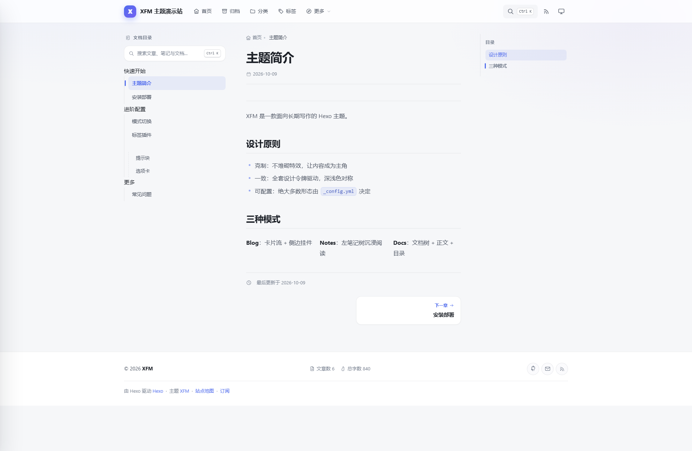
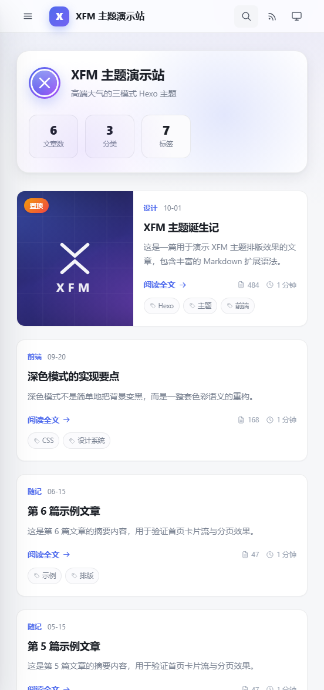
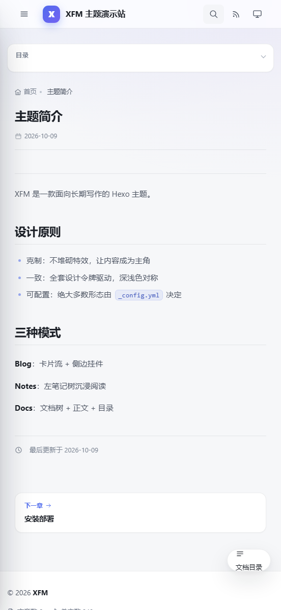

# XFM Theme

> 高端大气的 Hexo 主题，一套代码覆盖 **博客 / 笔记 / 文档** 三种形态。

XFM 是一套面向长期写作的 Hexo 主题：全套设计令牌驱动、深浅色对称、三模式切换、几乎所有形态都由配置决定，无需改模板。

---

## 预览

<table>
  <tr>
    <td width="33%" align="center"><br><b>blog</b><br>卡片流 + 侧边挂件</td>
    <td width="33%" align="center"><br><b>notes</b><br>笔记树 + 沉浸阅读</td>
    <td width="33%" align="center"><br><b>docs</b><br>文档树 + 正文 + 目录</td>
  </tr>
</table>

手机档三种模式自动转为单栏，笔记 / 文档的左侧栏收起为抽屉，目录折叠为面板 —— 详见[四、自适应式响应](#四自适应式响应)。

<table>
  <tr>
    <td width="30%" align="center"></td>
    <td width="30%" align="center"></td>
  </tr>
  <tr>
    <td align="center"><sub>blog · 单栏卡片流</sub></td>
    <td align="center"><sub>docs · 抽屉侧栏 + 折叠目录 + 悬浮入口</sub></td>
  </tr>
</table>

---

## 一、特性总览

| 维度 | 能力 |
| --- | --- |
| 形态 | blog 卡片流 / notes 笔记树 / docs 三栏文档 |
| 外观 | 深浅色三态切换（浅色、深色、跟随系统）、主色自定义、圆角档位、磨砂导航、背景光晕 |
| 导航 | 两级下拉菜单、移动端抽屉、当前项高亮、滚动自动隐藏、RSS 入口 |
| 搜索 | 内置全文检索索引 + Cmd/Ctrl+K 唤起 + 键盘导航 + 关键词高亮 |
| 目录 | 侧栏目录件 / 独立目录栏，滚动跟随高亮、自动滚入可见区 |
| 代码块 | 语言标签、Mac 风格三色点、复制按钮、长代码折叠、gutter 行号、自研深浅色配色 |
| 标签插件 | 提示块、折叠、选项卡、时间轴、栅格、按钮、徽标、图标、流程图、链接卡片 |
| 内容增强 | 标题锚点、表格滚动容器、外链新窗、图片懒加载与灯箱、任务列表、数学公式、Mermaid |
| 评论 | giscus / utterances / waline / twikoo / disqus / disqusjs / valine / 畅言 |
| SEO | OG / Twitter Card、canonical、JSON-LD、内置 sitemap.xml 与 robots.txt、404 页 |
| 阅读体验 | 阅读进度条、返回顶部、平滑滚动、滚动入场动画、文章过时提醒、版权卡、打赏、分享、相关文章 |
| 国际化 | 内置 zh-CN / en，i18n 文案抽离到 `languages/` |
| 交付质量 | 自适应三档（mobile / tablet / desktop，可配置）、触摸与刘海屏适配、打印样式、动效降级（`prefers-reduced-motion`）、语义化标签 |

---

## 二、安装

```bash
git clone https://github.com/xfm0797/hexo-theme-xfm.git themes/xfm
```

站点 `_config.yml`：

```yaml
theme: xfm
```

### 依赖

Hexo 8 起核心不再内置渲染器与部分生成器，请在站点安装（通常 `hexo init` 已自带）：

```bash
npm i hexo-renderer-marked hexo-renderer-ejs \
      hexo-generator-index hexo-generator-archive \
      hexo-generator-category hexo-generator-tag
```

按需增强（可选）：

| 功能 | 依赖 |
| --- | --- |
| RSS | `npm i hexo-generator-feed` |
| KaTeX / MathJax | 无需安装，主题按配置从 CDN 加载 |
| Mermaid | 无需安装，主题按配置从 CDN 加载 |

> 站点根目录的 `package.json` 需要包含 `"hexo": { "version": "..." }` 字段，Hexo 才会加载外部插件（这也是 404 / sitemap 等内置生成器能否工作的前提）。

---

## 三、三种模式

在主题 `_config.yml` 顶部切换：

```yaml
mode: blog    # blog / notes / docs
```

- **blog**：首页 Hero + 文章卡片流 + 右侧挂件栏，适合个人博客
- **notes**：左侧笔记树（按分类/日期分组）+ 沉浸式窄栏阅读 + 右侧目录
- **docs**：左侧文档树 + 正文 + 右侧目录三栏，适合产品文档

单篇文章可通过 front-matter 覆盖：`mode: docs`。

### 文档模式侧边栏

在站点 `source/_data/docs.yml` 中定义树形结构（字段名可通过 `docs.data_file` 改）：

```yaml
- title: 快速开始
  children:
    - title: 主题简介
      path: /docs/intro/
    - title: 安装部署
      path: /docs/install/
```

未定义该文件时，会自动按页面的 `order` + `title` 生成侧边栏。

---

## 四、自适应式响应

主题用的是**自适应（Adaptive）**，不是传统的「响应式（Responsive）」：

| | 响应式 Responsive | 自适应 Adaptive（本主题） |
| --- | --- | --- |
| 判定方式 | `@media (max-width…)` 由浏览器连续匹配 | 先识别设备档位，写入 `<html data-tier>` |
| 布局变化 | 同一套 DOM 随宽度连续缩放 | 每档一整套独立令牌 + 栏数 + 组件形态，档位之间跳变 |
| 结构差异 | 靠 CSS 变形 | 导航 / 侧栏 / 目录按档位切换 `bar·drawer`、`sticky·inline·offcanvas·hide`、`sticky·panel·hide` |
| 配置入口 | 六档断点宽度的数值 | 三档的「边界 + 形态」，形态是可读的枚举而非像素 |

流程只有两步：**`<head>` 里的探测脚本先定档 → 档位样式接管布局**。
档位边界、每档形态、组件开关全部集中在 `adaptive` 一节，改配置即可，**不要改模板或 CSS**。

```yaml
adaptive:
  enable: true               # 关闭则恒定使用 default_tier 的布局
  strategy: adaptive         # adaptive 设备识别 / responsive 纯宽度 / fixed 固定档
  default_tier: desktop      # 探测失败兜底档（fixed 策略也用它）
  remember: true             # 记住手动切换的档位（localStorage）

  detect:                    # 探测维度（responsive 策略自动只保留 width）
    width: true              # 视口宽度
    ua: true                 # UA 设备指纹（iPhone / iPad / Android 平板…）
    touch: true              # 触摸能力 → data-input="touch"
    dpr: true                # 像素密度 → data-dpr
    orientation: true        # 横竖屏 → data-orientation
    upgrade_large_screen: true   # 大屏平板升级为桌面档

  tiers:                     # 三档定义
    mobile:
      max_width: 767         # ≤ 该宽度或 UA 命中手机
      layout: single         # single / two-column / three-column
      nav: drawer            # bar 顶部菜单 / drawer 抽屉
      sidebar: offcanvas     # offcanvas 抽屉 / inline 内联折叠 / hide 隐藏 / sticky 吸附
      toc: panel             # panel 折叠面板 / sticky 常驻 / hide 隐藏
      container_width:       # 留空用该档默认值
      content_width:
      fluid: false           # 该档是否启用流式字号（true = 档内平滑缩放）
      density: compact       # comfortable / compact
      disable: []            # 该档关闭的组件，见下表
    tablet:
      max_width: 1079
      layout: two-column
      nav: drawer
      sidebar: inline
      toc: hide
      density: comfortable
      disable: []
    desktop:
      min_width: 1080        # 自动 ≥ tablet.max_width + 1
      layout: three-column
      nav: bar
      sidebar: sticky
      toc: sticky
      density: comfortable
      disable: []

  # 与档位无关的通用适配
  touch_target: 44           # 触摸设备最小可点击边长（px）
  safe_area: true            # 适配刘海屏 / 手势条安全区
  compact_height: true       # 矮屏（手机横屏）压缩纵向留白
  user_zoom: true            # 是否允许双指缩放
  fluid_min_width: 360       # 流式字号插值参考宽度
  fluid_max_width: 1440
```

### 默认三档分别交付什么

| 档位 | 判定 | 栏数 | 导航 | 笔记/文档侧栏 | 目录 | 密度 |
| --- | --- | --- | --- | --- | --- | --- |
| mobile | 宽度 ≤ 767 或 UA 命中手机 | 单栏 | 汉堡抽屉 | 抽屉（悬浮按钮唤起） | 正文顶部折叠面板 | compact |
| tablet | 768 ~ 1079（或平板 UA） | 双栏 | 汉堡抽屉 | 内联折叠卡片 | 隐藏 | comfortable |
| desktop | ≥ 1080 | 三栏 | 横排菜单 | 吸附左栏 | 吸附右栏 | comfortable |

每档都会拿到一整套独立的设计令牌（容器宽度、栏宽、间距、导航高度、六级字号），
所以档位切换是**整档跳变**，不会出现「半桌面半手机」的中间态。
某档把 `fluid: true` 打开后，该档内部才会做平滑缩放（clamp）。

### 组件开关（disable）

每档可独立关掉不合适的组件，可选键：

| 键 | 作用元素 |
| --- | --- |
| `hero` | 首页欢迎语大卡 |
| `cover` | 文章封面图 |
| `related` | 相关文章 |
| `sidebar` | blog 侧边挂件栏 |
| `toc` | 右侧目录栏 |
| `footer_stats` | 页脚统计 |
| `brand_text` | 导航栏站点标题 |
| `comments` | 评论区 |
| `share` | 分享按钮组 |

例：手机档只保留正文 —— `tiers.mobile.disable: [hero, cover, related]`。

### 实现方式

| 环节 | 文件 | 职责 |
| --- | --- | --- |
| 定档 | `layout/_partials/adaptive-boot.ejs` | `<head>` 首行同步脚本：解析 URL `?__tier=` / localStorage → UA 指纹 → 宽度，写入 `data-tier`（渲染前完成，无闪烁） |
| 出样式 | `layout/_partials/adaptive-style.ejs` | 按 `adaptive` 配置生成 `html[data-tier="…"]` 规则，每档令牌 + 栏数 + 形态 |
| 转结构 | `layout/layout.ejs` | 构建期写入兜底档位与 `side-nav-*` 变体标记，保证抽屉所需节点存在 |
| 运行时 | `source/js/adaptive.js` | `XFM.adaptive.tier() / setTier() / clearTier() / onTierChange()`，跨档派发 `xfm:tierchange` |
| 与档位无关 | `source/css/adaptive.css` | 打印样式、`prefers-reduced-motion` 降级 |

前端脚本不再写死断点：所有阈值来自配置，由模板注入（`window.XFM.adaptive`）。
`xfm_breakpoints()` 仍保留，由 `adaptive` 反算旧的六档断点，老站点不升级配置也能直接跑。

---

## 五、核心配置速查

主题全部配置集中在 `themes/xfm/_config.yml`，站点可用 `theme_config` 覆盖同名键。常用项：

```yaml
appearance:
  scheme: auto        # light / dark / auto
  primary: "#4f6bed"  # 主色
  radius: normal      # sharp / normal / round
  glass_navbar: true

navbar:
  sticky: true
  auto_hide: true

index:
  layout: card        # card / list / grid / classic
  hero: true
  sticky: true
  alternate_layout: true

post:
  toc: true
  toc_depth: [2, 3, 4]
  meta: [author, date, updated, categories, wordcount, reading]
  copyright: true
  reward: false

sidebar:
  position: right     # left / right / none
  widgets: [profile, recent_posts, categories, tagcloud, archive_list]

search:
  enable: true
  path: search.json
  hotkey: true

code_block:
  copy: true
  language: true
  mac_style: true
  max_height: -1      # 设为 20 表示超过 20 行自动折叠

comments:
  enable: false
  type: giscus        # 8 种可选
  lazyload: true
```

完整的注释版配置请直接查看 `_config.yml`（每项都有中文说明）。

### 需要的独立页面

```bash
hexo new page tags         # front-matter 加 type: tags
hexo new page categories   # front-matter 加 type: categories
hexo new page links        # front-matter 加 type: links
hexo new page archives     # 无需额外 type
```

---

## 六、标签插件

所有标签插件在 Markdown 正文中直接使用：

````markdown

支持 primary / info / success / warning / danger / tip / quote 八种语义。



默认收起的内容。加 open 参数可默认展开。



<!-- tab 第一项 -->
内容一
<!-- endtab -->
<!-- tab 第二项 -->
内容二
<!-- endtab -->




节点内容




左半栏
右半栏








graph LR
  A --> B

````

同时也兼容 `…` 的原生写法。

---

## 七、Front-matter 支持字段

```yaml
---
title: 文章标题
date: 2026-10-01
updated: 2026-10-09
categories: [分类]
tags: [标签一, 标签二]
cover: /images/cover.jpg      # 首图卡片封面 + OG 图
banner: /images/banner.jpg    # 同 cover，优先级更高
description: 自定义描述
keywords: 关键词
sticky: 100                   # 置顶权重，越大越靠前
toc: false                    # 单篇关闭目录
sidebar: false                # 单篇关闭侧边栏
comments: false               # 单篇关闭评论
mode: docs                    # 单篇指定模式
cover_style: inline           # inline 时封面不作为 Hero
order: 1                      # 笔记/文档模式排序权重
---
```

---

## 八、目录结构

```
themes/xfm
├── _config.yml              # 主题配置（唯一入口，全部中文注释）
├── languages/               # default / zh-CN / en
├── layout/                  # EJS 模板
│   ├── layout.ejs           # 三模式外壳分发
│   ├── index / post / page / archive / category / tag / 404
│   └── _partials/           # head / header / footer / sidebar / toc /
│                            # search / comment / widgets / notes / docs…
│                            # adaptive-boot.ejs 定档、adaptive-style.ejs 按配置生成档位样式
├── preview/                 # README 用的模式预览图
├── scripts/
│   ├── filters/content.js   # 代码块工具条、标题锚点、表格容器、外链、懒加载
│   ├── generators/          # search.json、sitemap.xml、robots.txt、404
│   ├── helpers/index.js     # 封面、摘要、字数、目录树、笔记/文档导航、计数
│   └── tags/index.js        # 全部标签插件
└── source/
    ├── css/                 # variables · base · layout · components · post · plugins · adaptive
    ├── js/                  # adaptive · core · toc · search
    └── images/              # avatar / favicon / 默认封面（SVG，零外链）
```

---

## 九、自定义

**覆盖样式**：在站点 `source/_data/styles.styl` 之外，推荐直接把自定义 CSS/JS 放进主题后，通过配置注入：

```yaml
custom:
  head: ""        # 注入 <head>
  body_end: ""    # 注入 </body> 前
  css: [custom]   # 加载 /css/custom.css
  js: [custom]    # 加载 /js/custom.js
  post_footer: "" # 每篇文章底部
```

**主色**：改 `appearance.primary`，全站链接、按钮、进度条、选中态同步生效（基于 CSS 变量）。

**圆角**：改 `appearance.radius`，sharp / normal / round 三档。

---

## 十、浏览器支持

Chrome / Edge / Firefox / Safari 最近两个大版本。使用了 CSS 变量、`backdrop-filter`、`aspect-ratio`、`IntersectionObserver`；旧浏览器会优雅降级（失去磨砂与动画，不影响阅读）。

---

## 十一、许可

MIT License。
